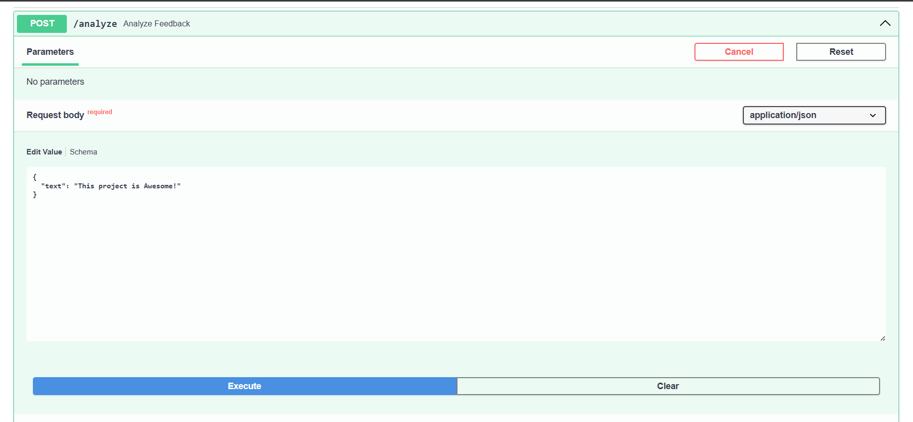
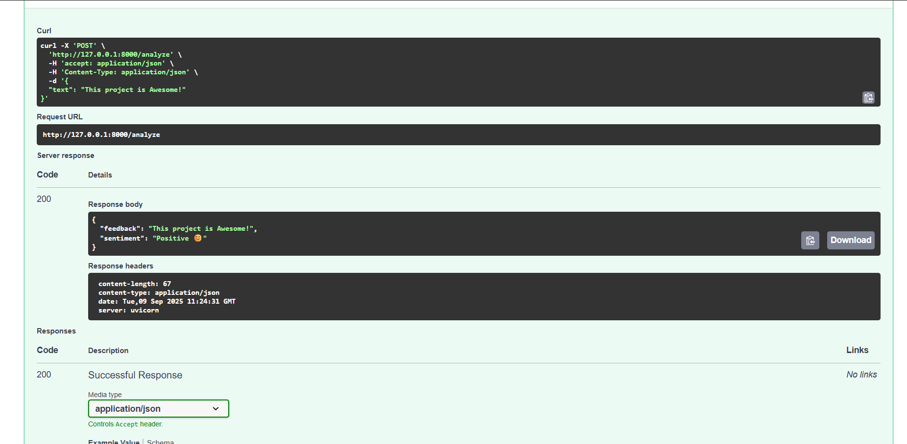

# 📝 Sentiment Analysis API

A simple **FastAPI + NLTK project** that predicts whether feedback is **Positive, Negative, or Neutral**.

“Deployed a Sentiment Analysis project with both backend and frontend:

API (FastAPI on Render): https://sentiment-analysis-5128.onrender.com
    /docs (FastAPI docs).

Frontend (Vercel): https://sentiment-analysis-fjnjtkrai-rudra-khandelwals-projects.vercel.app?_vercel_share=1sgDJUSlh3FzpJ9Tw4pnr8viQux9TQsh
 - interactive web interface(very basic for now) for testing the model.”

 How to use:-
---

1. Clone repo & go to backend

   git clone https://github.com/your-username/sentiment-analysis-api.git
   -cd sentiment-analysis-api/backend

2. Setup environment

-python -m venv myenv            **Creates your virtual environment.**
-myenv\Scripts\activate   # Windows Or  source myenv/bin/activate   # Mac/Linux         **Activate your virtual environrment.**
-pip install -r requirements.txt             **Install Dependencies**

3. Run the API

uvicorn app:app --reload     **Run the app**

Note: API will be live at 👉 http://127.0.0.1:8000

📌 Example

POST /analyze

{ "text": "This project is awesome!" }

Response

{ "feedback": "This project is awesome!", "sentiment": "Positive 😊" }

🛠️ Tech Used

FastAPI
NLTK (VADER)
Python
